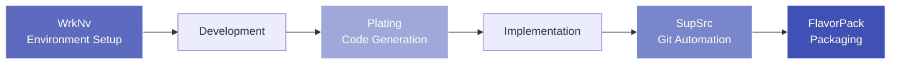

# Development Tools

The Development Tools layer provides workflow automation, packaging, and code generation utilities that streamline the development process across the provide.io ecosystem. These tools work together to support the complete development lifecycle from environment setup through packaging and deployment.

## Development Workflow

## Tool Ecosystem

Each tool addresses a specific aspect of the development workflow:

**CI/CD Tooling**: Automated continuous integration and delivery pipelines. Provides GitHub Actions, reusable workflows, and pre-commit hooks for Python projects.

**FlavorPack**: Secure executable packaging using PSPF/2025 specification. Bundles Python applications with all dependencies into single-file executables with signature verification.

**Plating**: Documentation and code generation templates. Creates boilerplate code, documentation scaffolding, and project structures from templates.

**SupSrc**: Automated Git workflow and commit management. Handles commit creation, branch management, and repository operations with smart automation.

**WrkNv**: Work environment management and toolchain automation. Manages Python environments, project workspaces, and development tool installation.

## Workflow Integration

These tools are designed to work together throughout the development process:

1. **Setup** (WrkNv): Initialize project environment and install dependencies
2. **Generate** (Plating): Create boilerplate code and documentation structure
3. **Develop**: Implement features using the frameworks
4. **Commit** (SupSrc): Automate Git operations and commit management
5. **Package** (FlavorPack): Build and sign distributable executables

## Packages

-   :material-check-circle: **CI/CD Tooling**

    ---

    Automated continuous integration and delivery with GitHub Actions, reusable workflows, and pre-commit hooks.

    [:octicons-arrow-right-24: Explore CI/CD Tooling](https://github.com/provide-io/ci-tooling)

-   :material-package: **FlavorPack**

    ---

    Secure executable packaging system using PSPF/2025 for single-file Python application distribution.

    [:octicons-arrow-right-24: Explore FlavorPack](../packages/flavorpack.md)

-   :material-briefcase: **WrkNv**

    ---

    Work environment management and toolchain automation for Python projects.

    [:octicons-arrow-right-24: Explore WrkNv](../packages/wrknv.md)

-   :material-git: **SupSrc**

    ---

    Automated Git workflow and commit management with smart automation.

    [:octicons-arrow-right-24: Explore SupSrc](../packages/supsrc.md)

-   :material-file-document-multiple: **Plating**

    ---

    Documentation and code generation templates for boilerplate creation.

    [:octicons-arrow-right-24: Explore Plating](../packages/plating.md)

