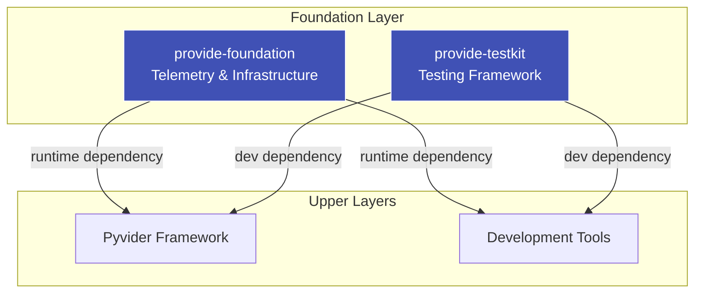

# Foundation

The Foundation layer provides foundational utilities and testing frameworks that power the entire provide.io ecosystem. All framework and tool packages depend on these packages for consistent logging, telemetry, configuration, and testing capabilities.

## Architecture

## Layer Design

**Foundation** provides cross-cutting runtime concerns:

- Structured logging with OpenTelemetry integration
- Type-safe configuration management
- Telemetry and distributed tracing
- Common validation and error handling utilities

**TestKit** provides development-time testing support:

- Pytest fixtures for provider and tool testing
- Mock Terraform plugin server
- Test utilities and assertion helpers
- Integration test scaffolding

Together, these packages ensure consistent patterns across the entire ecosystem while remaining lightweight and focused on their specific concerns.

## Packages

-   :material-layers: **Foundation**

    ---

    Core runtime utilities for telemetry, logging, and configuration that all ecosystem packages depend on.

    [:octicons-arrow-right-24: Explore Foundation](../packages/foundation.md)

-   :material-test-tube: **TestKit**

    ---

    Comprehensive testing framework with fixtures and utilities for provider and tool development.

    [:octicons-arrow-right-24: Explore TestKit](../packages/testkit.md)

