# Architecture

The Provide Foundry is built on a four-layer architecture that promotes separation of concerns, maintainability, and extensibility. This document provides a deep dive into the architectural decisions, patterns, and principles that guide the foundry.

## Overview

```mermaid
graph TB
    subgraph "Applications Layer"
        APP1[Terraform Providers]
        APP2[CLI Tools]
        APP3[Web Services]
    end

    subgraph "Tools Layer"
        direction TB
        FP[flavorpack<br/>📦 Packaging]
        WE[wrknv<br/>🛠️ Environment]
        PL[plating<br/>📚 Documentation]
        TS[tofusoup<br/>🧪 Testing]
        SS[supsrc<br/>🔄 Git Automation]
    end

    subgraph "Framework Layer"
        direction TB
        PY[pyvider<br/>🏗️ Core Framework]
        CTY[pyvider-cty<br/>🔢 Type System]
        HCL[pyvider-hcl<br/>📄 Configuration]
        RPC[pyvider-rpcplugin<br/>🔌 Protocol]
        COMP[pyvider-components<br/>🧩 Components]
    end

    subgraph "Foundation Layer"
        direction TB
        FOUND[provide-foundation<br/>🏛️ Infrastructure]
        TEST[provide-testkit<br/>🧪 Testing]
    end

    APP1 --> PY
    APP1 --> COMP
    APP2 --> FP
    APP3 --> FOUND

    FP --> FOUND
    WE --> FOUND
    PL --> PY
    TS --> CTY
    SS --> FOUND

    PY --> FOUND
    CTY --> FOUND
    HCL --> CTY
    RPC --> FOUND
    COMP --> PY

    TEST --> FOUND

    classDef foundation fill:#e1f5fe,stroke:#01579b,stroke-width:2px
    classDef framework fill:#f3e5f5,stroke:#4a148c,stroke-width:2px
    classDef tools fill:#e8f5e8,stroke:#1b5e20,stroke-width:2px
    classDef apps fill:#fff3e0,stroke:#e65100,stroke-width:2px

    class FOUND,TEST foundation
    class PY,CTY,HCL,RPC,COMP framework
    class FP,WE,PL,TS,SS tools
    class APP1,APP2,APP3 apps
```



## Layer Responsibilities

### Foundation Layer

The foundation provides core infrastructure services that all other components rely on:

#### provide-foundation
- **Structured Logging**: Emoji-enhanced, high-performance logging
- **Error Handling**: Rich error context and hierarchical error types
- **Configuration**: Type-safe configuration management
- **Platform Detection**: Cross-platform compatibility utilities
- **Process Management**: Subprocess and async process handling
- **Hub Pattern**: Centralized component discovery and registration

#### provide-testkit
- **Testing Framework**: Unified testing utilities across all packages
- **Fixtures**: Reusable test fixtures organized by domain
- **Mocking**: Comprehensive mocking utilities
- **Property-Based Testing**: Integration with Hypothesis
- **Async Testing**: Support for async/await testing patterns

### Framework Layer

The framework layer implements the core abstractions for building Terraform providers:

#### pyvider (Core Framework)
- **Provider Model**: `@provider` decorator and lifecycle management
- **Resource Model**: `@resource` decorator with CRUD operations
- **Data Source Model**: `@data_source` decorator for read-only resources
- **Function Model**: `@function` decorator for Terraform functions
- **Schema System**: Type-safe schema definition and validation
- **Hub Integration**: Component discovery and registration

#### pyvider-cty (Type System)
- **CTY Types**: Complete implementation of Terraform's type system
- **Value Handling**: Type-safe value creation and manipulation
- **Conversion**: Bidirectional conversion between Python and CTY types
- **Validation**: Comprehensive type validation
- **JSON Codec**: Serialization to/from JSON
- **MessagePack Codec**: Binary serialization for performance

#### pyvider-hcl (Configuration Language)
- **HCL Parsing**: Parse HCL configuration files
- **CTY Integration**: Convert HCL values to CTY types
- **Expression Evaluation**: Evaluate HCL expressions
- **Template Processing**: HCL template functionality

#### pyvider-rpcplugin (Protocol Implementation)
- **gRPC Server**: Terraform plugin protocol server
- **Transport Layer**: Unix sockets and TCP transport
- **Handshake Protocol**: Secure plugin handshake
- **Schema Translation**: Convert schemas to Terraform format
- **Request Handling**: Process Terraform RPC requests

#### pyvider-components (Standard Library)
- **Standard Resources**: Common resource implementations
- **Standard Data Sources**: Useful data source implementations
- **Standard Functions**: Library of Terraform functions
- **Examples**: Reference implementations and examples

### Tools Layer

The tools layer provides development and deployment utilities:

#### flavorpack (Packaging)
- **PSPF Format**: Progressive Secure Package Format implementation
- **Multi-Language**: Go, Rust, and Python launcher support
- **Self-Contained**: Bundles runtime and dependencies
- **Signature Verification**: Ed25519 signature validation
- **Cross-Platform**: Support for multiple OS/architecture combinations

#### wrknv (Environment Management)
- **Environment Generation**: Create standardized development environments
- **Tool Management**: Install and manage development tools
- **Sibling Detection**: Automatic discovery of related packages
- **Platform Support**: Cross-platform environment setup
- **Configuration**: TOML-based configuration management

#### plating (Documentation)
- **Schema Extraction**: Generate documentation from provider schemas
- **Template System**: Jinja2-based documentation templates
- **Example Integration**: Include Terraform examples in documentation
- **Test Runner**: Validate examples through testing
- **Multi-Format**: Support for various documentation formats

#### tofusoup (Conformance Testing)
- **Cross-Language Testing**: Test compatibility between implementations
- **Conformance Suites**: Standardized test suites
- **Performance Testing**: Benchmark implementations
- **Regression Testing**: Detect breaking changes
- **Report Generation**: Comprehensive test reporting

#### supsrc (Git Automation)
- **File Watching**: Monitor filesystem for changes
- **Auto-Commit**: Automatic commit based on rules
- **Rule Engine**: Configurable commit triggers
- **Branch Management**: Automatic branch operations
- **Integration**: Works with existing Git workflows

## Design Patterns

### Hub Pattern

The foundry uses a centralized hub pattern for component discovery and registration:

```python
from provide.foundation.hub import get_hub

# Register a component
hub = get_hub()
hub.register("my_component", MyComponent())

# Discover components
components = hub.discover_by_type(ResourceBase)
```

This pattern enables:
- **Loose Coupling**: Components don't need direct references
- **Dynamic Discovery**: Find components at runtime
- **Plugin Architecture**: Easy to add new components
- **Testing**: Mock components easily

### Decorator-Based Registration

Framework components use decorators for clean registration:

```python
@provider
class MyProvider:
    """Provider implementation."""
    pass

@resource
class MyResource:
    """Resource implementation."""
    pass
```

Benefits:
- **Clean Syntax**: Minimal boilerplate
- **Automatic Registration**: No manual registration required
- **Type Safety**: Compile-time validation
- **Discoverability**: Easy to find all components

### Schema-First Design

All data structures are defined with comprehensive schemas:

```python
from pyvider.schema import Attribute, Block

class ResourceConfig:
    name: str = Attribute(required=True, description="Resource name")
    settings: dict = Block(description="Configuration settings")
```

Advantages:
- **Validation**: Automatic data validation
- **Documentation**: Self-documenting schemas
- **IDE Support**: Excellent autocomplete and type checking
- **Error Messages**: Clear validation error messages

### Layered Error Handling

Errors are handled in a layered approach with rich context:

```python
from provide.foundation.errors import FoundationError

class ProviderError(FoundationError):
    """Provider-specific error."""

    def _default_code(self) -> str:
        return "PROVIDER_ERROR"
```

Features:
- **Hierarchical**: Errors inherit from base types
- **Contextual**: Rich error context and metadata
- **Structured**: Consistent error structure
- **Actionable**: Clear error messages with solutions

## Data Flow Architecture

### Provider Execution Flow


### Package Build Flow


## Configuration Architecture

### Hierarchical Configuration

Configuration is managed in a hierarchical system:

```
Global Config (provide-foundation)
├── Package Config (pyproject.toml)
├── Environment Config (.env)
├── User Config (~/.provide/config.toml)
└── Runtime Config (CLI arguments)
```

### Type-Safe Configuration

All configuration uses type-safe schemas:

```python
@attrs.define
class LoggingConfig:
    level: str = "INFO"
    format: str = "json"
    emoji: bool = True

    def __attrs_post_init__(self):
        if self.level not in ["DEBUG", "INFO", "WARN", "ERROR"]:
            raise ValueError(f"Invalid log level: {self.level}")
```

## Performance Architecture

### Async-First Design

The foundry is built with async operations as the primary pattern:

```python
async def create_resource(config: ResourceConfig) -> ResourceState:
    """Create a resource asynchronously."""
    async with provider_context():
        result = await external_api.create(config)
        return ResourceState(id=result.id, status="created")
```

### Lazy Loading

Components are loaded lazily to minimize startup time:

```python
def get_component(name: str):
    """Get component with lazy loading."""
    if name not in _loaded_components:
        _loaded_components[name] = _load_component(name)
    return _loaded_components[name]
```

### Caching Strategy

Multi-level caching improves performance:

1. **Memory Cache**: In-process caching of frequently accessed data
2. **Disk Cache**: Persistent caching of build artifacts
3. **Network Cache**: CDN caching for package distribution

## Security Architecture

### Defense in Depth

Security is implemented at multiple layers:

1. **Package Level**: Digital signatures and integrity checking
2. **Transport Level**: TLS encryption for network communication
3. **Process Level**: Sandboxing and privilege separation
4. **Data Level**: Input validation and sanitization

### Signature Verification

All packages are signed with Ed25519 signatures:

```python
def verify_package(package_path: Path, signature_path: Path, public_key: bytes) -> bool:
    """Verify package signature."""
    package_hash = hash_file(package_path)
    signature = load_signature(signature_path)
    return verify_signature(package_hash, signature, public_key)
```

### Secure Defaults

All components use secure defaults:

- **Minimal Permissions**: Least privilege principle
- **No Sensitive Logging**: Sensitive data filtered from logs
- **Input Validation**: All inputs validated before processing
- **Error Handling**: No sensitive data in error messages

## Extension Points

The architecture provides multiple extension points:

### Custom Resources

```python
@resource
class CustomResource(ResourceBase):
    """Custom resource implementation."""

    def create(self, config):
        # Custom creation logic
        pass
```

### Custom Processors

```python
class CustomLogProcessor:
    """Custom log processor."""

    def __call__(self, logger, method_name, event_dict):
        # Custom processing logic
        return event_dict
```

### Custom Transports

```python
class CustomTransport(TransportBase):
    """Custom transport implementation."""

    async def send(self, message):
        # Custom transport logic
        pass
```

## Potential Considerations

The architecture is designed to support potential enhancements:

### Microservices Support

The layered architecture can be decomposed into microservices:

- **Foundation Services**: Logging, configuration, error handling
- **Framework Services**: Schema validation, type conversion
- **Tool Services**: Build, test, documentation

### Multi-Language Support

The RPC layer enables multi-language implementations:

- **Go Providers**: Using the same RPC protocol
- **Rust Providers**: High-performance implementations
- **JavaScript Providers**: Web-based tooling

### Cloud Native

The architecture supports cloud-native deployment:

- **Containerization**: All components can be containerized
- **Orchestration**: Kubernetes-native deployment
- **Observability**: Prometheus metrics and distributed tracing

---

Continue exploring the foundry with our [design principles](principles.md) or see how this architecture applies in practice with our [development guides](../guides/index.md).
