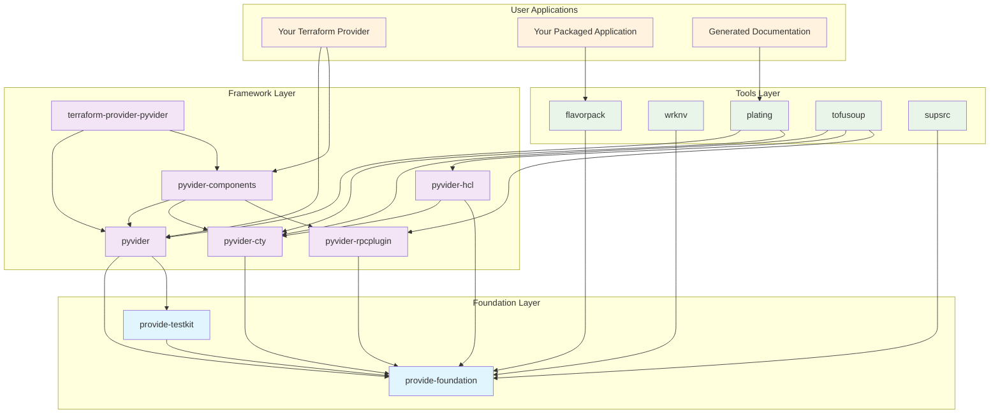
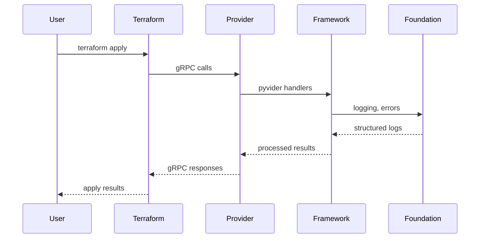
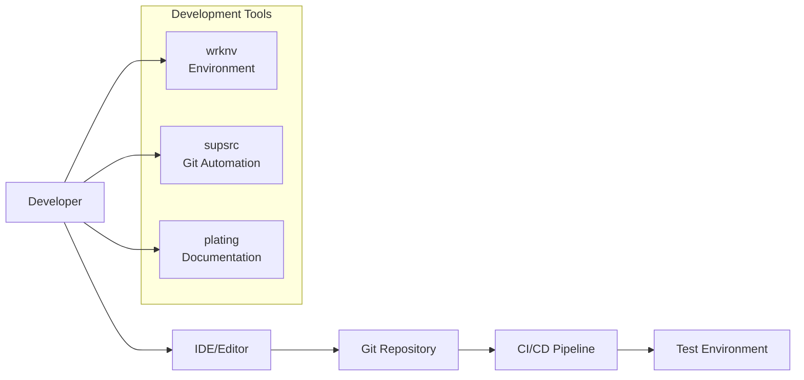
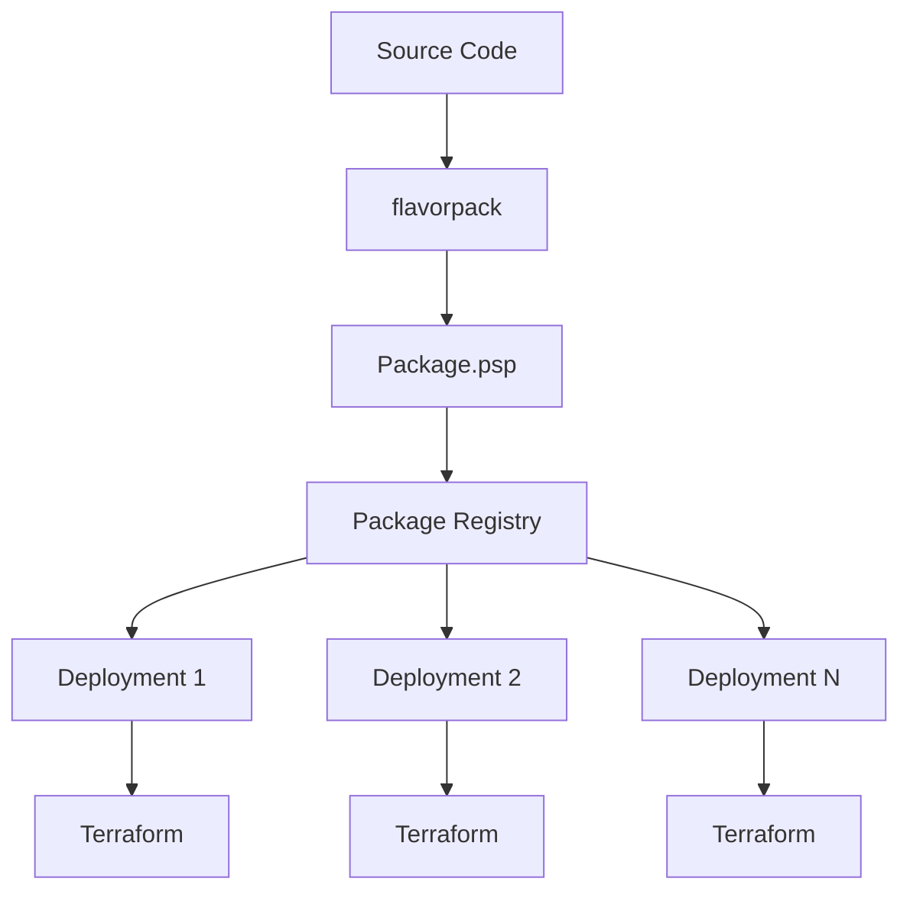

# Welcome to the Provide Foundry

The Provide Foundry is a comprehensive collection of Python tools and frameworks designed to make building Terraform providers, packaging applications, and managing development workflows both powerful and enjoyable.

## What is the Provide Foundry?

A unified ecosystem of Python packages for:

- **Building Terraform providers in Python** - The Pyvider Framework brings Python's elegance to infrastructure as code
- **Packaging applications as secure executables** - FlavorPack creates self-contained binaries from Python applications
- **Managing development environments** - WrkNv standardizes tooling and dependencies across projects
- **Testing and conformance validation** - TofuSoup ensures cross-language compatibility
- **Documentation generation** - Plating creates beautiful, registry-compliant docs

## Why Does It Exist?

**Problem**: Building Terraform providers traditionally requires Go expertise, has limited tooling options, and makes testing complex infrastructure code difficult.

**Solution**: The Provide Foundry brings the power of Python's ecosystem to Terraform provider development, with:

- Type-safe APIs using modern Python 3.11+ features
- Comprehensive testing frameworks with fixtures and mocks
- Automated packaging and distribution tools
- First-class documentation generation
- Structured logging and observability built-in

## When Should You Use It?

Use the Provide Foundry when you:

- Want to build Terraform providers in Python instead of Go
- Need to package Python applications as self-contained executables
- Require sophisticated testing for infrastructure code
- Want a unified, opinionated development workflow
- Value developer experience and clear documentation

## Quick Navigation

<div class="grid cards" markdown>

-   :material-layers:{ .lg .middle } **Understand the Ecosystem**

    Learn the architecture and design principles behind the Foundry.

    [:octicons-arrow-right-24: Explore Details Below](#design-philosophy)

-   :material-package-variant:{ .lg .middle } **Browse Packages**

    See all available packages and their capabilities.

    [:octicons-arrow-right-24: View Packages](packages/)

-   :material-rocket-launch:{ .lg .middle } **Start Building**

    Get up and running with your first provider.

    [:octicons-arrow-right-24: Getting Started](getting-started.md)

-   :material-school:{ .lg .middle } **Learn Best Practices**

    Deep dive into patterns and workflows.

    [:octicons-arrow-right-24: Read Guides](guides/)

</div>

---

## Design Philosophy

The foundry is built around core principles that ensure consistency, maintainability, and developer experience:

<div class="grid cards" markdown>

-   :material-layers:{ .lg } **Layered Architecture**

    Clear separation between foundation, framework, and tools with well-defined interfaces.

-   :material-typewriter:{ .lg } **Type Safety First**

    Comprehensive type annotations using modern Python 3.11+ features throughout.

-   :material-rocket-launch:{ .lg } **Developer Experience**

    Excellent error messages, comprehensive documentation, and intuitive APIs.

-   :material-test-tube:{ .lg } **Testing Excellence**

    High test coverage with unit, integration, and property-based testing.

</div>

## Package Relationships

Understanding how packages relate to each other helps you choose the right tools for your needs:



## Package Categories

### Foundation Layer

The foundation provides core infrastructure that all other packages build upon:

- **[provide-foundation](packages/foundation.md)**: Structured logging, error handling, configuration
- **[provide-testkit](packages/testkit.md)**: Testing utilities, fixtures, and test infrastructure

### Framework Layer

The Pyvider framework enables building Terraform providers in Python:

- **[pyvider](packages/pyvider.md)**: Core framework with provider, resource, and data source abstractions
- **[pyvider-cty](packages/pyvider-cty.md)**: Implementation of Terraform's CTY type system
- **[pyvider-hcl](packages/pyvider-hcl.md)**: HCL parsing and generation with CTY integration
- **[pyvider-rpcplugin](packages/pyvider-rpcplugin.md)**: Terraform plugin protocol implementation
- **[pyvider-components](packages/pyvider-components.md)**: Standard library of components
- **[terraform-provider-pyvider](packages/terraform-provider-pyvider.md)**: Meta-package demonstrating the framework

### Tools Layer

Development and deployment tools that enhance the development experience:

- **[flavorpack](packages/flavorpack.md)**: Create self-contained executable packages
- **[wrknv](packages/wrknv.md)**: Development environment management
- **[plating](packages/plating.md)**: Documentation generation for Terraform providers
- **[tofusoup](packages/tofusoup.md)**: Cross-language conformance testing
- **[supsrc](packages/supsrc.md)**: Automated Git workflow management

## Data Flow

Understanding how data flows through the foundry helps with debugging and optimization:



## Deployment Architecture

The foundry supports multiple deployment patterns:

### Development Mode



### Production Deployment



## Quality Assurance

The foundry maintains high quality through multiple layers of validation:

### Code Quality

- **Type Checking**: MyPy with strict settings
- **Linting**: Ruff with comprehensive rule sets
- **Formatting**: Consistent code style across all packages
- **Security**: Bandit security scanning

### Testing Strategy

- **Unit Tests**: High coverage for individual components
- **Integration Tests**: Cross-package functionality validation
- **Property-Based Testing**: Hypothesis for edge case discovery
- **Conformance Tests**: TofuSoup for Terraform compatibility

### Documentation Quality

- **API Documentation**: Comprehensive coverage of all public APIs
- **Examples**: Working code examples for all major features
- **Guides**: Step-by-step tutorials for common tasks
- **Architecture**: Clear explanations of design decisions

## Versioning Strategy

The foundry uses semantic versioning with coordinated releases:

### Individual Package Versions

Each package maintains its own version following semantic versioning:

- **Major**: Breaking changes to public APIs
- **Minor**: New features, backward compatible
- **Patch**: Bug fixes, backward compatible

### Foundry Compatibility

Packages declare compatibility with specific versions of their dependencies:

```toml
# Example from pyvider-components
dependencies = [
    "provide-foundation>=0.1.0,<0.2.0",
    "pyvider>=0.1.0,<0.2.0",
    "pyvider-cty>=0.0.113,<0.1.0"
]
```

### Release Coordination

Major releases are coordinated across packages to ensure compatibility:

1. **Planning**: Major changes discussed across affected packages
2. **Alpha/Beta**: Pre-release versions for testing
3. **Release Candidates**: Final validation before release
4. **Coordinated Release**: All packages released together

## Performance Characteristics

The foundry is designed for performance at scale:

### Logging Performance

- **14,000+ messages/second** with emoji processing
- **Async-first** design for non-blocking operations
- **Structured data** for efficient processing

### Provider Performance

- **Fast startup**: Minimal import time
- **Efficient gRPC**: Optimized protocol implementation
- **Memory management**: Careful resource handling

### Build Performance

- **Incremental builds**: Only rebuild what changed
- **Parallel execution**: Multi-core utilization
- **Caching**: Aggressive caching of build artifacts

## Security Considerations

Security is built into the foundry at multiple levels:

### Package Security

- **Signed packages**: Ed25519 signatures for integrity
- **Dependency scanning**: Automated vulnerability detection
- **Minimal dependencies**: Reduced attack surface

### Runtime Security

- **Secure defaults**: Safe configuration out of the box
- **Input validation**: Comprehensive data validation
- **Error handling**: No sensitive data in error messages

### Development Security

- **Secret management**: No secrets in code or logs
- **Access control**: Principle of least privilege
- **Audit logging**: Comprehensive activity logging

---

Ready to dive deeper? Explore our [architecture guide](foundry/architecture.md) or learn about our [design principles](foundry/principles.md).
