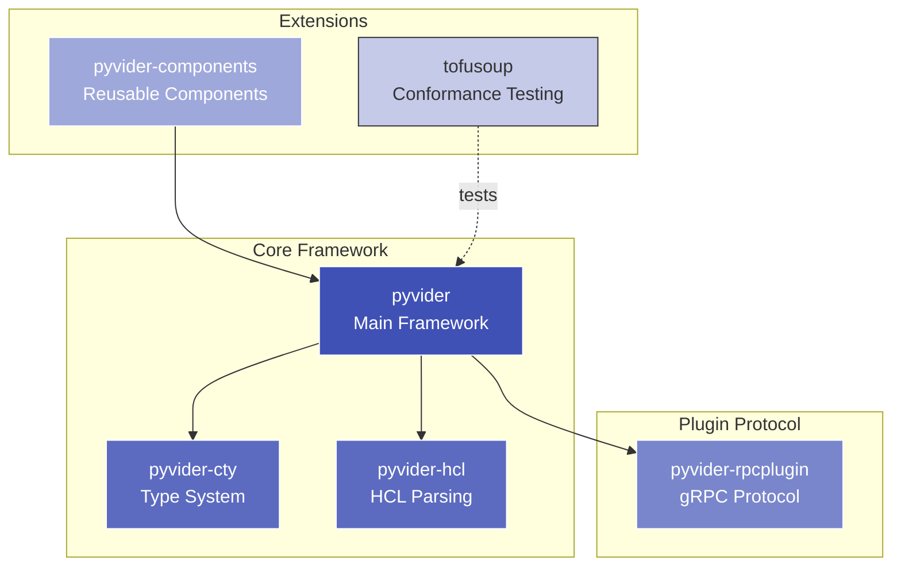

# Pyvider Framework

Pyvider is a comprehensive Python framework for building Terraform providers. It implements the complete Terraform plugin protocol, allowing you to create providers in Python rather than Go, with full support for resources, data sources, and provider configuration.

## Architecture

## Framework Components

The Pyvider framework is composed of several specialized packages that work together:

**Core Layer** (pyvider, pyvider-cty, pyvider-hcl):

- **pyvider**: Main framework orchestrating provider lifecycle, resource management, and Terraform integration
- **pyvider-cty**: Python bindings for Terraform's CTY type system, enabling type-safe data handling
- **pyvider-hcl**: HCL parsing and manipulation for configuration processing

**Protocol Layer** (pyvider-rpcplugin):

- Implements Terraform's gRPC plugin protocol (versions 5 and 6)
- Handles communication between Terraform CLI and Python providers
- Manages plugin lifecycle, health checks, and graceful shutdown

**Extension Layer** (pyvider-components, tofusoup):

- **pyvider-components**: Library of reusable provider components (CRUD patterns, state management, validation)
- **tofusoup**: Cross-language conformance testing framework ensuring providers behave correctly across Terraform/OpenTofu

## Framework Design

Pyvider follows Terraform's provider architecture while leveraging Python's strengths:

- **Type Safety**: Uses Pydantic models for resource schemas, validated at runtime
- **Async Support**: Native async/await for I/O-bound operations (API calls, database queries)
- **Developer Experience**: Python's ecosystem, tooling, and ergonomics for rapid development
- **Protocol Compliance**: Full implementation of Terraform plugin protocol for compatibility

The framework handles the complexity of Terraform's plugin protocol, allowing you to focus on implementing your provider's business logic.

## Packages

-   :material-language-python: **Pyvider**

    ---

    Core framework for building Terraform providers in Python with full protocol support.

    [:octicons-arrow-right-24: Explore Pyvider](../packages/pyvider.md)

-   :material-code-braces: **Pyvider CTY**

    ---

    Python bindings for Terraform's CTY type system, enabling type-safe data handling.

    [:octicons-arrow-right-24: Explore CTY](../packages/pyvider-cty.md)

-   :material-file-code: **Pyvider HCL**

    ---

    HCL parsing and manipulation for Terraform configuration processing.

    [:octicons-arrow-right-24: Explore HCL](../packages/pyvider-hcl.md)

-   :material-api: **Pyvider RPC Plugin**

    ---

    gRPC plugin protocol implementation for Terraform provider communication.

    [:octicons-arrow-right-24: Explore RPC Plugin](../packages/pyvider-rpcplugin.md)

-   :material-package-variant: **Pyvider Components**

    ---

    Reusable provider components, patterns, and utilities for common use cases.

    [:octicons-arrow-right-24: Explore Components](../packages/pyvider-components.md)

-   :material-test-tube: **TofuSoup**

    ---

    Cross-language conformance testing framework for Terraform and OpenTofu providers.

    [:octicons-arrow-right-24: Explore TofuSoup](../packages/tofusoup.md)

