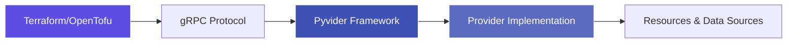

# Terraform Providers

The Terraform Providers layer enables infrastructure-as-code using Python-based Terraform providers built on the Pyvider framework. These providers allow you to manage infrastructure resources using Terraform/OpenTofu while implementing provider logic in Python.

## Provider Architecture

## Available Providers

The provide.io ecosystem includes two production Terraform providers:

**Pyvider Provider**: Reference implementation showcasing the Pyvider framework capabilities. Demonstrates resource lifecycle management, data sources, and provider configuration patterns.

**TofuSoup Provider**: Infrastructure testing and conformance provider. Enables testing Terraform configurations and validating infrastructure compliance using the TofuSoup conformance framework.

## Provider Features

Each provider is built on the Pyvider framework and provides:

- **Type Safety**: Full CTY type system integration for Terraform data types
- **HCL Support**: Native HCL parsing and manipulation
- **gRPC Protocol**: Terraform plugin protocol v6 support
- **Resource Management**: Complete CRUD lifecycle support
- **Data Sources**: Read-only data source implementations
- **Provider Configuration**: Flexible provider-level configuration
- **Schema Validation**: Automatic schema validation and type checking

## Development Workflow

Building Terraform providers with Pyvider:

1. **Define Resources**: Use Pyvider resource decorators to define resource schemas
2. **Implement CRUD**: Implement Create, Read, Update, Delete operations
3. **Add Data Sources**: Define read-only data sources for external data
4. **Configure Provider**: Set up provider-level configuration and authentication
5. **Test**: Use TofuSoup for conformance testing
6. **Package**: Build and distribute using FlavorPack

## Provider Integration

Terraform providers integrate seamlessly with the ecosystem:

- **Foundation**: Uses provide-foundation for logging and telemetry
- **Pyvider Framework**: Built on pyvider core, cty, hcl, and rpcplugin
- **Testing**: Validated using provide-testkit and tofusoup
- **Packaging**: Distributed using FlavorPack secure packaging

## Providers

-   :material-terraform: **Pyvider Provider**

    ---

    Reference Terraform provider implementation showcasing Pyvider framework capabilities and best practices.

    [:octicons-arrow-right-24: Explore Pyvider Provider](https://foundry.provide.io/terraform-provider-pyvider/)

-   :material-test-tube: **TofuSoup Provider**

    ---

    Infrastructure testing and conformance provider for validating Terraform configurations.

    [:octicons-arrow-right-24: Explore TofuSoup Provider](https://foundry.provide.io/terraform-provider-tofusoup/)

